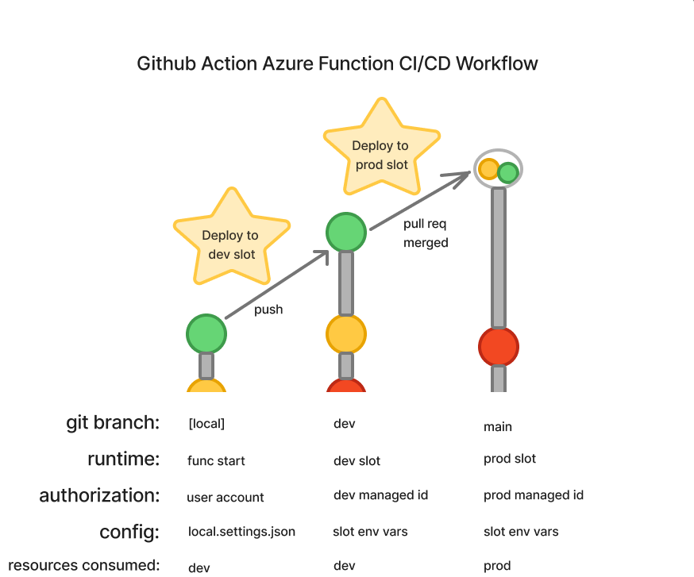

# Github Action to Azure Fn Demo
This repository is intended to serve as a starting point for one possible way of developing source-controlled Azure Python Functions with automated deployment actions. 

This guide assumes a dual environment setup, `dev` and `prod`, which correspond to the git branches `dev` and `main`, respectively, as well as development and production deployment slots in an Azure Function App.

## Workflows

### Triggers
This repository uses GitHub Actions workflows to automate deployments. The workflows are triggered based on branch activity:
- **Push to `dev` branch**:
  - Deploys the function to the **staging slot** (`demo-fn-dev/stage`).
- **Push to `main` branch**:
  - Deploys the function to the **production slot** (`demo-fn-dev`).
  - This *should* only be done via an approved merge request from the `dev` branch which can be enforced by disallowing direct pushes to `main` at the Github Repository Settings level

### Deployment Process
1. **Dependency Installation**:
   - The workflow installs Python dependencies specified in `requirements.txt` using `pip`.
2. **Packaging**:
   - The function app is packaged, including the `host.json`, `HttpTrigger` directory, and dependencies.
3. **Deployment**:
   - The function app is deployed to the appropriate Azure Function App slot using the publish profile:
     - `AZURE_FUNCTIONAPP_PUBLISH_PROFILE_STAGE` for the `stage` slot.
     - `AZURE_FUNCTIONAPP_PUBLISH_PROFILE_PROD` for the production slot.

---

## Local Development

### Library prerequisites
- [Azure Functions Core Tools](https://learn.microsoft.com/en-us/azure/azure-functions/functions-run-local) (v4 or later)
- [Azure CLI](https://learn.microsoft.com/en-us/cli/azure/install-azure-cli)

### Environment Configuration
The function app requires the following environment variables:

- `KEY_VAULT_URL`: The URL of the Azure Key Vault
- `SECRET_NAME`: The name of the secret to retrieve from the Key Vault.
- These variables can be set in `local.settings.json`:

### Running locally
1. cd to `src/demo-fn` directory
2. start locally with `func start`
3. navigate to `http://localhost:7071/api/HttpTrigger` 

